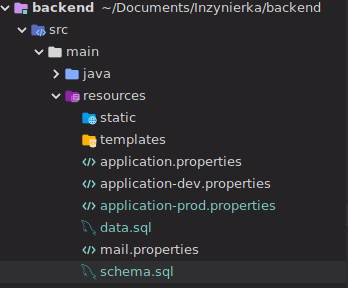
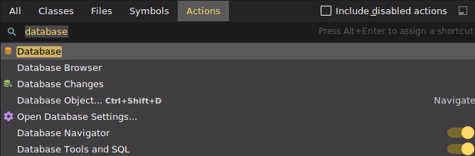
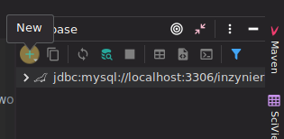
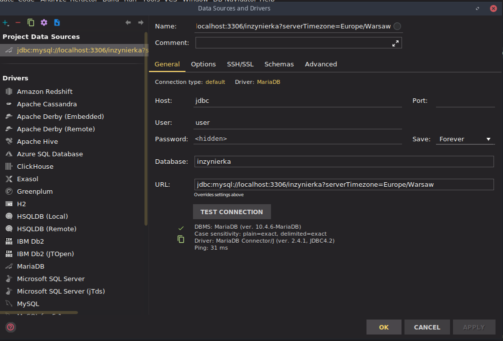
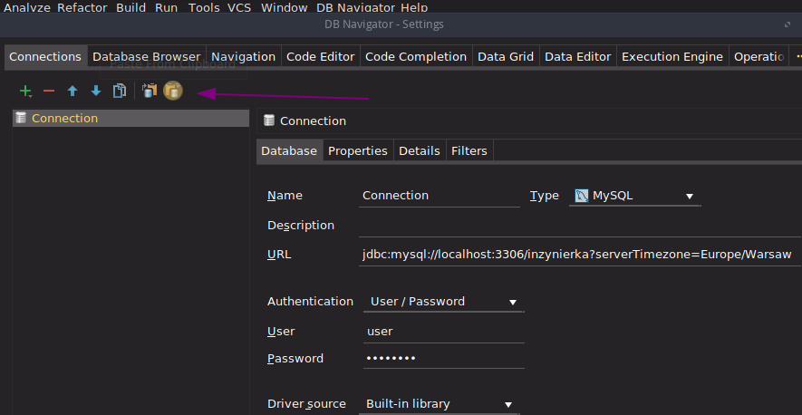
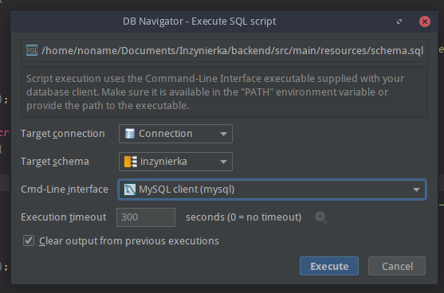

# Inzynierka

SERVER PART INSTALLATION
***
First install:
* OpenJDK 11.0.3 2019-04-16
* OpenJDK Runtime Environment (build 11.0.3+4)


If you already had Java installed, 
modify you **JAVA_HOME** environmental variable to include newly installed JRE version.

***
Database:

MYSQL/MARIADB

Open terminal and run: 

**myslq -u root -p**

In db console run: 

**CREATE DATABASE inzynierka;**  
**CREATE USER \`user\`@\`localhost\` IDENTIFIED BY \`Admin123\`;**
**GRANT ALL PRIVILEGES ON inzynierka.\* TO \`user\`@\`localhost\`**

***
Initialization:

**FIRST METHOD** 

Find mariadb/mysql executable ( for example C:\Program Files(x86)\mariadb\bin\mariadb.exe )   
Copy the path to the folder and open terminal ( for example git bash) 


Find the path to schema.sql file by right clicking on the file from the tree view and choose 
`copy path` option.


  


Now run from the console: 

{path-to-mysql}\mariadb.exe --user=user --password=Admin123 -e "source {path-to-schema-file}"  
or  
{path-to-mysql}\mariadb.exe --user=user --password=Admin123 < {path-to-schema-file}

Run the same command with the data.sql  

**SECOND METHOD** 
---
Install Intellij Ultimate Edition

Type ctrl+shift+a to find action and the type `database`  




Add new  datasource and select mariadb from dropdown list:  



Now configure it in this way:




Find the schema.sql and data.sql files in project tree view ( alt+1) and 
run them from context menu (option `Run 'schema.sql'` and `Run 'data.sql'` respectively)


**THIRD OPTION** 
--
IT DIDN'T WORK FOR ME, BUT YOU CAN TRY (DB Navigator will be useful)

Install Database Navigator plugin in Intellij Community Edition:

`ctrl+shift+a` to find actions and type `plugins`  
Search in marketplace for Database Navigator, install it and restart intellij.

`ctrl+shift+a DB navigator` and choose settings option 




Copy to clipboard following xml and choose option showed above with pointing arrow. 


```xml
<?xml version="1.0" encoding="UTF-8"?>
<connection-configurations>
  <config id="57b56592-1607-43df-845c-ea180cb3669f" active="true">
    <database>
      <name value="Connection" />
      <description value="" />
      <database-type value="MYSQL" />
      <config-type value="CUSTOM" />
      <database-version value="5.5" />
      <driver-source value="BUILTIN" />
      <driver-library value="" />
      <driver value="" />
      <url value="jdbc:mysql://localhost:3306/inzynierka?serverTimezone=Europe/Warsaw" />
      <type value="USER_PASSWORD" />
      <user value="user" />
      <deprecated-pwd value="QWRtaW4xMjM=" />
    </database>
    <properties>
      <auto-commit value="false" />
    </properties>
    <ssh-settings>
      <active value="false" />
      <proxy-host value="" />
      <proxy-port value="22" />
      <proxy-user value="" />
      <deprecated-proxy-pwd value="" />
      <auth-type value="PASSWORD" />
      <key-file value="" />
      <key-passphrase value="" />
    </ssh-settings>
    <ssl-settings>
      <active value="false" />
      <certificate-authority-file value="" />
      <client-certificate-file value="" />
      <client-key-file value="" />
    </ssl-settings>
    <details>
      <charset value="UTF-8" />
      <session-management value="true" />
      <ddl-file-binding value="true" />
      <database-logging value="false" />
      <connect-automatically value="true" />
      <restore-workspace value="true" />
      <restore-workspace-deep value="true" />
      <environment-type value="default" />
      <idle-time-to-disconnect value="60" />
      <idle-time-to-disconnect-pool value="5" />
      <credential-expiry-time value="30" />
      <max-connection-pool-size value="7" />
      <alternative-statement-delimiter value="" />
    </details>
    <object-filters hide-empty-schemas="false" hide-pseudo-columns="false">
      <object-type-filter use-master-settings="true">
        <object-type name="SCHEMA" enabled="true" />
        <object-type name="USER" enabled="true" />
        <object-type name="ROLE" enabled="true" />
        <object-type name="PRIVILEGE" enabled="true" />
        <object-type name="CHARSET" enabled="true" />
        <object-type name="TABLE" enabled="true" />
        <object-type name="VIEW" enabled="true" />
        <object-type name="MATERIALIZED_VIEW" enabled="true" />
        <object-type name="NESTED_TABLE" enabled="true" />
        <object-type name="COLUMN" enabled="true" />
        <object-type name="INDEX" enabled="true" />
        <object-type name="CONSTRAINT" enabled="true" />
        <object-type name="DATASET_TRIGGER" enabled="true" />
        <object-type name="DATABASE_TRIGGER" enabled="true" />
        <object-type name="SYNONYM" enabled="true" />
        <object-type name="SEQUENCE" enabled="true" />
        <object-type name="PROCEDURE" enabled="true" />
        <object-type name="FUNCTION" enabled="true" />
        <object-type name="PACKAGE" enabled="true" />
        <object-type name="TYPE" enabled="true" />
        <object-type name="TYPE_ATTRIBUTE" enabled="true" />
        <object-type name="ARGUMENT" enabled="true" />
        <object-type name="DIMENSION" enabled="true" />
        <object-type name="CLUSTER" enabled="true" />
        <object-type name="DBLINK" enabled="true" />
      </object-type-filter>
      <object-name-filters />
    </object-filters>
  </config>
</connection-configurations>
```

Find the select `Execute Sql Script` option.
Configure it like this and run: 




**Database operations**
--
To `create tables` (it might be also used to clear data)  

{mariadb-executable} --user=user --password=Admin123 -e "call inzynierka.create_database"

To `clear data`  

{mariadb-executable} --user=user --password=Admin123 -e "call inzynierka.clear_data"

To `refresh data` (after execution the database will only contain data that were added with inserts procedures)  

{mariadb-executable} --user=user --password=Admin123 -e "call inzynierka.refresh_data"


***

Navigate to root folder and run:


* mvn spring-boot:build

to build application

* mvn spring-boot:run 

to run application

***
Open application navigating to **localhost:8090** in your web browser


